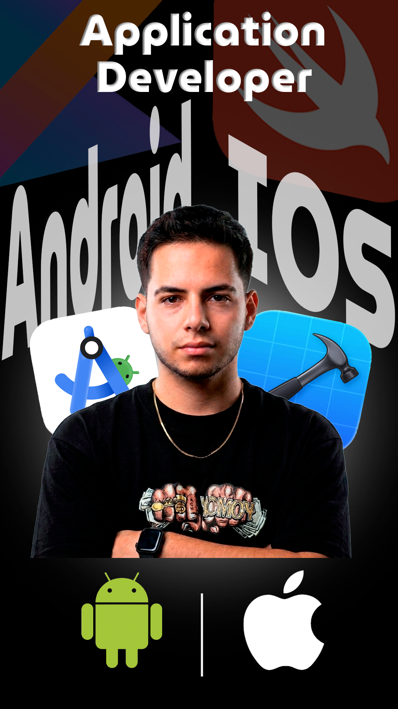
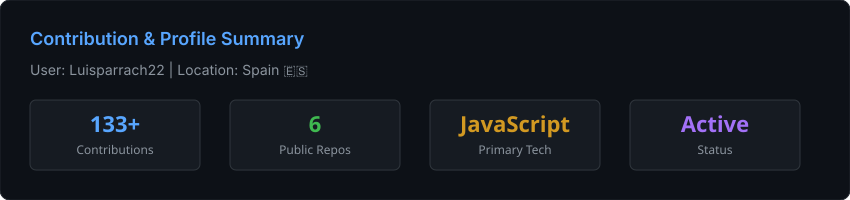
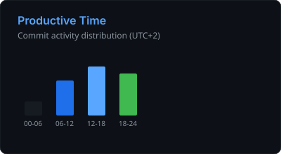
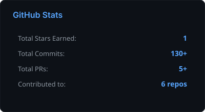
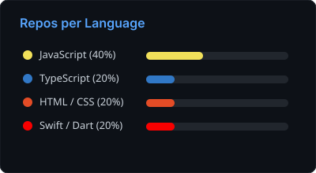
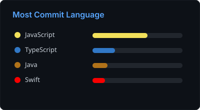

<div align="center">

<!-- ═══════════════════════════════════════════════════════════ -->
<!--                        HERO SECTION                        -->
<!-- ═══════════════════════════════════════════════════════════ -->


<a href="https://git.io/typing-svg">
  
</a>

<br/><br/>

<a href="mailto:luisparrach22@gmail.com"></a>
<a href="https://github.com/Luisparrach22"></a>


</div>

<br/>

<!-- ═══════════════════════════════════════════════════════════ -->
<!--                       ABOUT SECTION                        -->
<!-- ═══════════════════════════════════════════════════════════ -->

<h2>👨‍💻 &nbsp;About Me</h2>

<table>
<tr>
<td width="62%" valign="top">

Desarrollador de software enfocado en construir **productos sólidos de extremo a extremo**: desde la API y la base de datos hasta la app que el usuario tiene en su bolsillo.

Me apasiona escribir código limpio, mantenible y diseñar sistemas que **escalen sin dolor**.

```yaml
name:      Luis Parra
role:      Software Developer
location:  Spain 🇪🇸
focus:
  - Backend Development & Microservices
  - Mobile Apps (iOS · Android · Cross-Platform)
  - Database Design & Optimization
  - Workflow Automation & DevOps
learning:  Cloud Architecture
open_to:   Freelance & Collaboration
```

</td>
<td width="38%" align="center" valign="middle">



</td>
</tr>
</table>

<br/>

<!-- ═══════════════════════════════════════════════════════════ -->
<!--                    VALUE PROPOSITION                        -->
<!-- ═══════════════════════════════════════════════════════════ -->

<h2>🚀 &nbsp;What I Do</h2>

<div align="center">

<table>
<tr>
<td align="center" width="25%">
<br/>

<h3>Backend</h3>
<sub>APIs escalables y<br/>microservicios robustos</sub>
<br/><br/>
</td>
<td align="center" width="25%">
<br/>

<h3>Mobile</h3>
<sub>Apps nativas iOS / Android<br/>y cross-platform con Flutter</sub>
<br/><br/>
</td>
<td align="center" width="25%">
<br/>

<h3>Databases</h3>
<sub>Diseño, optimización y<br/>queries de alto rendimiento</sub>
<br/><br/>
</td>
<td align="center" width="25%">
<br/>

<h3>Automation</h3>
<sub>Workflows con n8n, Docker<br/>y entornos Linux</sub>
<br/><br/>
</td>
</tr>
</table>

</div>

<br/>

<!-- ═══════════════════════════════════════════════════════════ -->
<!--                       TECH STACK                           -->
<!-- ═══════════════════════════════════════════════════════════ -->

<h2>⚙️ &nbsp;Tech Stack</h2>

<div align="center">

<br/>


<br/><br/>

<table>
<tr>
<td align="right" width="140"><sub><b>LANGUAGES</b></sub></td>
<td>


</td>
</tr>
<tr>
<td align="right"><sub><b>FRAMEWORKS</b></sub></td>
<td>


</td>
</tr>
<tr>
<td align="right"><sub><b>DATABASES</b></sub></td>
<td>


</td>
</tr>
<tr>
<td align="right"><sub><b>DEVOPS & TOOLS</b></sub></td>
<td>


</td>
</tr>
</table>

</div>

<br/>

<!-- ═══════════════════════════════════════════════════════════ -->
<!--                     GITHUB ANALYTICS                       -->
<!-- ═══════════════════════════════════════════════════════════ -->

<h2>📊 &nbsp;GitHub Analytics</h2>

<div align="center">

<br/>



<br/><br/>




<br/><br/>





</div>

<br/>

<!-- ═══════════════════════════════════════════════════════════ -->
<!--                         FOOTER                             -->
<!-- ═══════════════════════════════════════════════════════════ -->

<div align="center">

<h3>🤝 &nbsp;Let's build something great together</h3>

<sub>¿Tienes un proyecto en mente o una idea que quieras llevar a producción? Escríbeme.</sub>

<br/><br/>

<a href="mailto:luisparrach22@gmail.com"></a>

<br/><br/>


<br/><br/>


</div>
